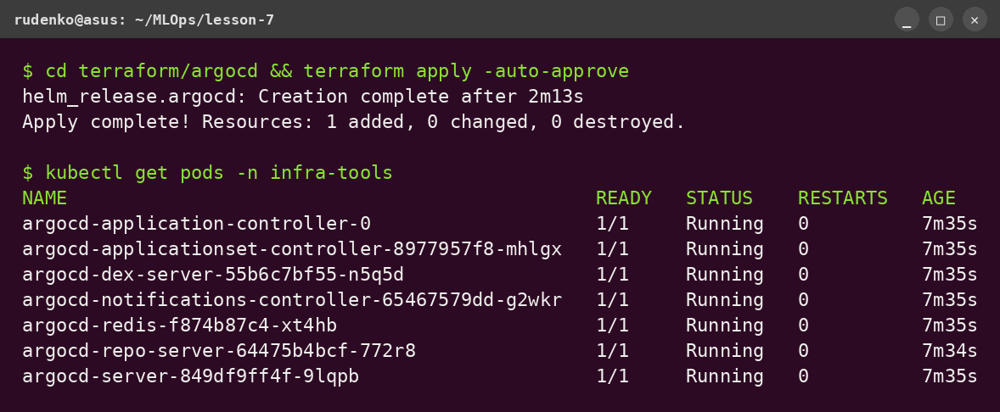
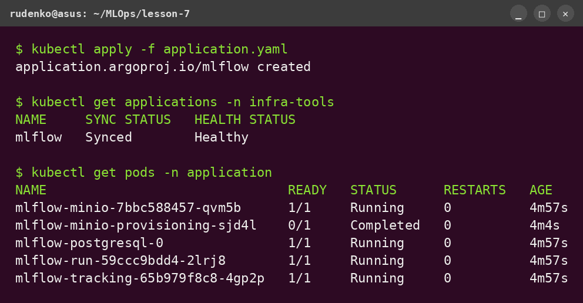
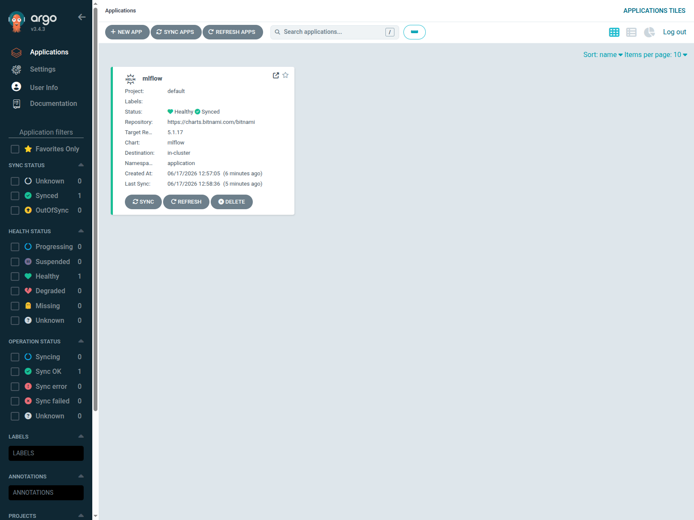
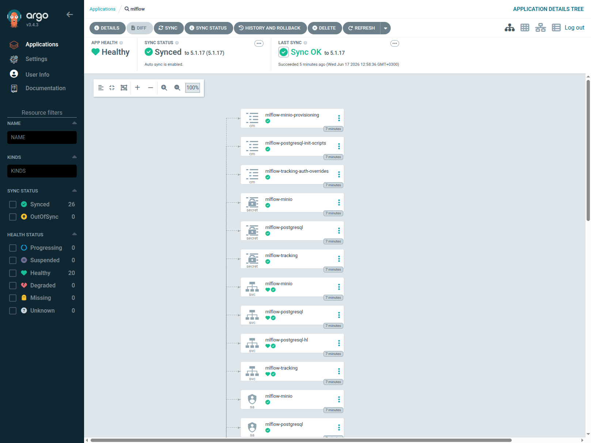

# Lesson 7 — ArgoCD (GitOps) через Terraform

ДЗ7: розгортання **ArgoCD** у EKS-кластері через Terraform і деплой **MLflow**
за принципом GitOps — ArgoCD сам створює ресурси з декларативного опису в Git.

## Архітектура

```
EKS (Тема 5-6)
└── ArgoCD (цей проєкт, namespace infra-tools, через Terraform helm_release)
        │  читає Application
        ▼
    Application "mlflow"  ──► Helm chart bitnami/mlflow  ──► namespace "application"
        (auto-sync + self-heal)                              (Deployment/Service/Pod)
```

- **Цей репозиторій** (`lesson-7`): Terraform-код, що ставить ArgoCD.
- **GitOps-репозиторій** з `application.yaml`: https://github.com/DenysRudenko2/goit-argo

## Результат

### ArgoCD розгорнуто через Terraform



### Application синхронізовано → MLflow задеплоєно



### ArgoCD UI — застосунок mlflow (Healthy / Synced)



### ArgoCD UI — дерево ресурсів (auto-sync)



## Структура

```
lesson-7/
└── terraform/
    └── argocd/
        ├── main.tf            # helm_release "argocd"
        ├── provider.tf        # aws + helm + kubernetes (auth до EKS)
        ├── variables.tf       # cluster_name, namespace, chart version…
        ├── outputs.tf         # команди port-forward / admin password
        ├── terraform.tf       # required_providers
        ├── backend.tf         # S3 backend
        └── values/
            └── argocd-values.yaml   # ClusterIP, extraArgs, rbac, timeouts
```

## Передумови

- Працюючий EKS-кластер `mlops-eks` (Тема 5-6), `kubectl` налаштований на нього
- Terraform >= 1.5, AWS CLI, Helm, kubectl
- Доступ до AWS (профіль `default`, регіон `eu-north-1`)

## 1. Розгортання ArgoCD (Terraform)

```bash
cd terraform/argocd
terraform init
terraform apply        # ставить ArgoCD як helm_release у namespace infra-tools
```

Перевірити, що ArgoCD працює (мають бути поди `argocd-*`):

```bash
kubectl get pods -n infra-tools
```

## 2. Вхід в ArgoCD UI

```bash
# port-forward (значення також у `terraform output`)
kubectl port-forward -n infra-tools svc/argocd-server 8080:80
```

Відкрити http://localhost:8080. Логін:

```bash
# user: admin
kubectl -n infra-tools get secret argocd-initial-admin-secret \
  -o jsonpath='{.data.password}' | base64 -d; echo
```

## 3. Деплой застосунку через GitOps

`application.yaml` лежить у GitOps-репо
[goit-argo](https://github.com/DenysRudenko2/goit-argo) і описує Helm-деплой MLflow
(`repoURL`, `chart`, inline `values`) з `auto-sync`, `self-heal`, `CreateNamespace`.

Зареєструвати Application у кластері:

```bash
kubectl apply -f https://raw.githubusercontent.com/DenysRudenko2/goit-argo/main/application.yaml
```

## 4. Перевірка деплою

```bash
kubectl get applications -n infra-tools        # mlflow: Synced / Healthy
kubectl get pods -n application                # поди MLflow, створені ArgoCD
```

Доступ до MLflow:

```bash
kubectl port-forward -n application svc/mlflow-tracking 5000:80
# → http://localhost:5000
```

## ⚠️ Вартість і прибирання

ArgoCD + MLflow працюють на EKS (~$3.6/день за кластер). Після перевірки:

```bash
cd terraform/argocd && terraform destroy        # знести ArgoCD
# і за потреби знести сам кластер (Тема 5-6):
# cd ../../../lesson-5-6 && terraform destroy
```

> S3-бакет зі стейтом лишити (backend).

## Примітки

- `argocd-values.yaml`: сервіс `ClusterIP`, `server.insecure` + `extraArgs: --insecure`,
  `rbac` (policy.default + policy.csv), `timeouts` реконсиляції.
- Образи Bitnami/MLflow переспрямовані на `bitnamilegacy` (Bitnami переніс безкоштовні
  образи у серпні 2025) — деталі в `application.yaml` репо goit-argo.
